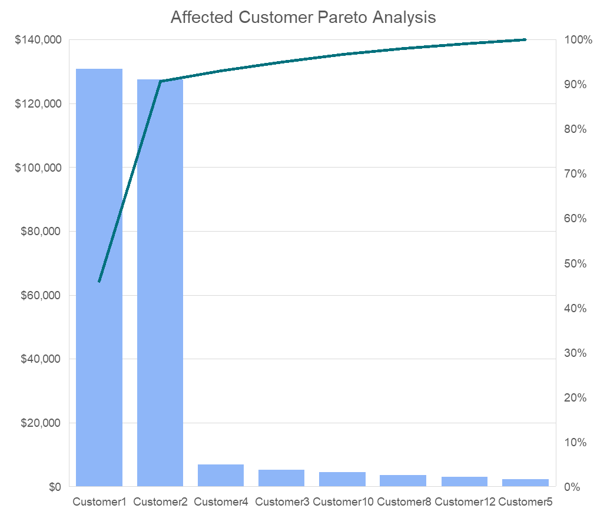
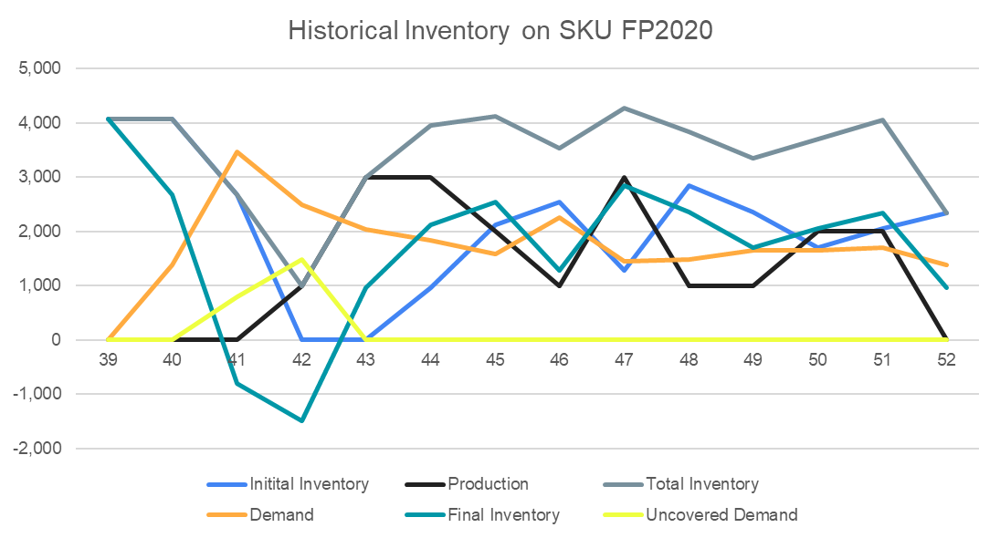

# **Unilever Using Data Analytics in Supply Chain Course at Coursera**

By    : Muhammad Fatih Idlan (faiti.alfaqar@gmail.com)
This project fulfills the Module 5 assignment (Prosacco activity presentation) for Unilever's Using Data Analytics in Supply Chain course on Coursera.

## Report Outline
- [Introduction](##introduction)
  - [Problem Statement](###problem-statement)
  - [Objectives](###objectives)
- [Analysis](##analysis)
  - [Affected Customer Pareto Analysis](###affected-customer-pareto-analysis)
  - [Historical SKUs Inventory Analysis](###historical-skus-inventory-analysis)
- [Key Takeaways](#key-takeaways)

## Introduction
### Problem Statement
As we know, according to the dataset, there are several customer complaint about delayed distribution on these country:
* Canada
* United States
* Mexico

### Objectives
* Determine the most affected customer
* Determine the root cause of delayed distribution
* Planning further strategy

## Analysis
### Affected Customer Pareto Analysis

As we can see, Customer 1 and 2 are the major affected customer during this issue. Both of them contributed around 95% of total uncovered sales.

### Historical SKUs Inventory Analysis

* Final inventory on week 41 & 42 are at negative level
* At the same week, there are sudden spike of uncovered demand due to increasing demand at week 41 and production pause from week 39 to 41

# Key Takeaways
* **Customer 1 & 2** contribute to **95%** sales of delayed distribution
* The causing issues are **increasing demand** at week 41 & **production pause** on week 39-41
* **Re-design** production **planning** to tackle delayed production
* Integrating production schedule with demand forecasting to **enhance** production **accuracy**
