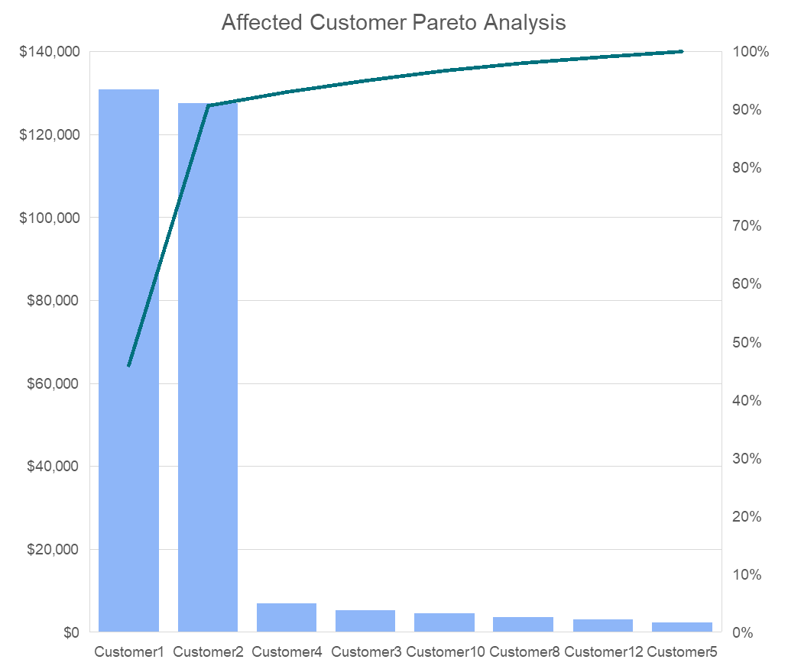

# **Unilever Using Data Analytics in Supply Chain Course at Coursera** :articulated_lorry:

By    : Muhammad Fatih Idlan (faiti.alfaqar@gmail.com) :shipit:

This project fulfills the Module 5 assignment (Prosacco activity presentation) for Unilever's Using Data Analytics in Supply Chain course on [Coursera](https://www.coursera.org/programs/industry-professional-credentials-track-blqcg/learn/using-data-analytics-in-supply-chain).

:warning: **The [dataset](Dataset.xlsx) used in this project is sourced from a fictitious company (which provided by this course) and was created for educational purposes to demonstrate my data analysis skills related to supply chain activity.**

## :pushpin: Report Outline
- [Introduction](#ticket-introduction)
  - [Problem Statement](#-problem-statement)
  - [Objectives](#-objectives)
- [Analysis](#-analysis)
  - [Affected Customer Pareto Analysis](#-affected-customer-pareto-analysis)
  - [Historical SKUs Inventory Analysis](#-historical-skus-inventory-analysis)
- [Key Takeaways](#-key-takeaways)

## :ticket: Introduction
### :construction: Problem Statement
As we know, according to the dataset, there are several customer complaint about delayed distribution on these country:
* Canada
* United States
* Mexico

### :dart: Objectives
* Determine the most affected customer
* Determine the root cause of delayed distribution
* Planning further strategy

## :clipboard: Analysis
### :bar_chart: Affected Customer Pareto Analysis

As we can see, Customer 1 and 2 are the major affected customer during this issue. Both of them contributed around 95% of total uncovered sales.

### :calendar: Historical SKUs Inventory Analysis

* Final inventory on week 41 & 42 are at negative level
* At the same week, there are sudden spike of uncovered demand due to increasing demand at week 41 and production pause from week 39 to 41

## :key: Key Takeaways
* **Customer 1 & 2** contribute to **95%** sales of delayed distribution
* The causing issues are **increasing demand** at week 41 & **production pause** on week 39-41
* **Re-design** production **planning** to tackle delayed production
* Integrating production schedule with demand forecasting to **enhance** production **accuracy**
